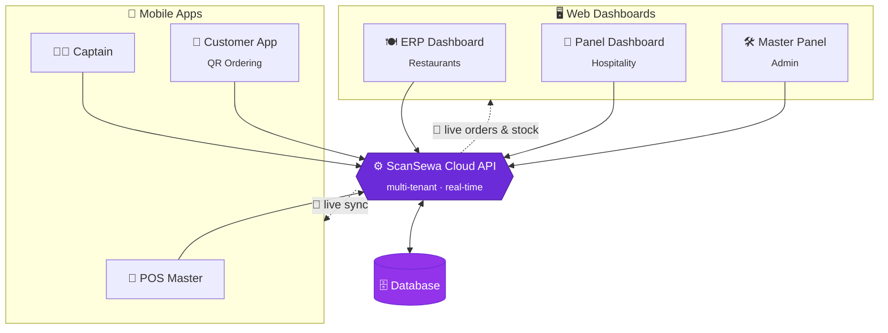

<!-- SEO: ScanSewa — AI-powered restaurant POS, billing, ERP, inventory, QR ordering & hotel/hospitality management software. Cloud POS for restaurants, cafés, bars and hotels across Asia and worldwide. A Lacspace product. -->

 

  

⚡ Built across **Asia** · Serving businesses **worldwide** 🌏 · A **[Lacspace](https://lacspace.com)** product

---

## 🌟 What is ScanSewa?

**ScanSewa** is an **AI-powered business-management platform** that runs an entire food & hospitality operation from one cloud system — **billing, orders, kitchen, menu, inventory, staff, customers, and hotel rooms** — synced in real time across every screen.

One café or a hundred-room hotel, ScanSewa replaces a drawer full of disconnected tools with **one login, one dashboard, everything in sync.**

**`Scan`** → **`Order`** → **`Fire to Kitchen`** → **`Bill & Pay`** → **`Auto-deplete Stock`** → **`See Profit`** — live.

---

## 🧩 One ecosystem, every surface

> A complete infrastructure — web dashboards, native mobile apps, and a real-time multi-tenant cloud — engineered as one product family.

### 🖥️ Web Dashboards
| Product | Built for | Highlights |
|---|---|---|
| 🍽️ **ERP Dashboard** | Restaurants & cafés | Fast billing, orders, tables, menu, **inventory + recipes**, purchases, expenses, sales & profit — a focused, restaurant-only ERP |
| 🏨 **Panel Dashboard** | Hospitality & hotels | The full hospitality suite — POS + **rooms, front-desk, housekeeping, bookings**, add-on modules & multi-outlet control |
| 🛠️ **Master Panel** | ScanSewa operators | Vendor onboarding, subscriptions, plans, add-on approvals & platform-wide control |

### 📱 Mobile Apps
| App | Built for | Highlights |
|---|---|---|
| 🧾 **POS Master** | Owners & cashiers | A full POS in your pocket — billing, orders, KOT printing & live dashboards |
| 🧑‍🍳 **Captain** | Waiters & riders | Take table orders and manage deliveries from the floor |
| 📲 **Customer App** | Diners & guests | QR-code menu, self-ordering & live order tracking |

### ⚙️ Cloud Infrastructure
A **multi-tenant, real-time API** (Socket.IO) that powers every dashboard and app — secure per-vendor isolation, live order & stock sync, and a modular add-on engine (Loyalty, Finance, CRM, Integrations, Developer API).

---

## 🗺️ How it all connects

---

## ✨ Why teams choose ScanSewa

- 🤖 **AI-powered insights** — turn every sale into decisions: revenue, cost, margin & trends at a glance
- ⚡ **Real-time everything** — orders, stock and payments sync live across POS, kitchen and phones
- 📦 **Inventory that tracks itself** — sales auto-deplete raw materials through recipe links
- 🧩 **Modular add-ons** — switch on Loyalty, Finance, CRM, Integrations & Developer API as you grow
- 🖨️ **Kitchen-ready** — KOT/KDS, thermal printing and table management out of the box
- ☁️ **Cloud-native & multi-device** — nothing to install; open a browser or the app and go
- 🔒 **Secure by design** — strict per-vendor data isolation on a multi-tenant core

---

## 🛠️ Engineering

---

## Ready to modernize your restaurant, café or hotel?

### **[🌐 scansewa.com](https://scansewa.com)** &nbsp;·&nbsp; **[🚀 Book a Demo](https://scansewa.com)** &nbsp;·&nbsp; **[✉️ info.scansewa@gmail.com](mailto:info.scansewa@gmail.com)**

 

© 2026 **ScanSewa** · Built by **[Lacspace Corporation](https://lacspace.com)** · AI-powered software, from Asia to the world 🌏

<!-- keywords: restaurant POS software, cloud billing system, restaurant ERP, QR code ordering, hotel management system, hospitality PMS, KOT KDS, inventory management, recipe costing, waiter app, kitchen display system, multi-tenant SaaS, restaurant management software Asia -->
